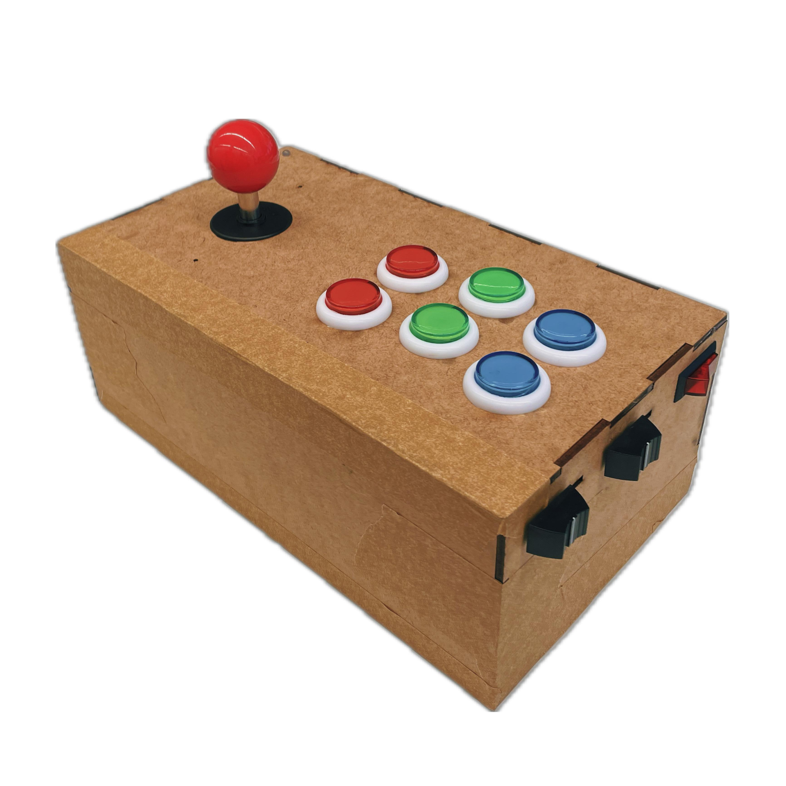
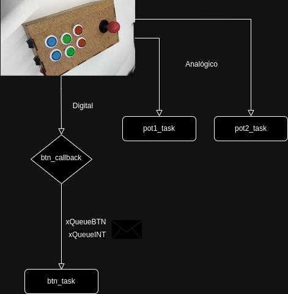

# Controle de arcade bluetooth

**Autores**: [Lucas Lima](https://github.com/lucasouzamil) e [Luiz Pini](https://github.com/luizehp)

O projeto "Controle de arcade bluetooth" é uma ideia conduzida por Lucas Lima e Luiz Pini, com o objetivo de desenvolver um controle de arcade utilizando uma Raspberry Pico em conjunto com o módulo HC-05. A ideia central é criar um dispositivo que permita aos usuários jogar em arcades de forma sem fio, utilizando a tecnologia Bluetooth para a comunicação entre o controle e o computador.

Clique [aqui](https://youtu.be/eLvp1XJyQmQ) para ver o vídeo de apresentação do projeto.

O projeto é desenvolvido utilizando a SDK da Raspberry Pico programada em FreeRTOS, proporcionando um ambiente de desenvolvimento flexível e robusto para a implementação das funcionalidades do controle de arcade. Isso permite uma gestão eficiente de recursos e tarefas, garantindo um desempenho otimizado do sistema. Segue abaixo o diagrama de blocos:

### Estrutura do programa

* **btn_callback**: Esta função de retorno de chamada é responsável por lidar com interrupções geradas pelas entradas digitais, como botões, joystick e um pino que monitora o status da conexão Bluetooth. Quando uma interrupção é acionada, esta tarefa cria uma estrutura de dados contendo o nome do botão correspondente e o valor digital associado a ele, e envia essa estrutura para a fila de mensagens xQueueBTN. Para o status do módulo Bluetooth, os dados são enviados para a fila xQueueINT.

* **btn_task**: Esta tarefa é encarregada de inicializar os pinos digitais, configurar e iniciar o módulo Bluetooth, e enviar os valores dos inputs digitais via Bluetooth. Ela coordena as operações relacionadas aos botões, joystick e ao pino de status da conexão Bluetooth.

* **pot1_task e pot2_task**: Estas tarefas são responsáveis por inicializar os pinos dos conversores analógico-digitais (ADCs), realizar a leitura dos sinais analógicos provenientes de potenciômetros e filtrar eventuais ruídos. A filtragem é realizada calculando-se a média das últimas 10 leituras para cada potenciômetro. Adicionalmente, essas tarefas enviam os valores médios via Bluetooth apenas quando há uma variação significativa nos valores lidos, garantindo uma comunicação eficiente e otimizando o consumo de energia do sistema.

Para utilizar o controle, é necessário compilar o código main.c para a Pico, conectar um computador com Linux via Bluetooth e executa o arquivo main.py localizado na pasta Python. Este programa tem a função de ler os dados recebidos via serial do Bluetooth e executar as ações correspondentes às configurações do controle.

### Caracterísitca do projeto

* Botão de liga/desliga
* Informação visual se o controle está conectado ou não
* 2x entradas analógicas
* 11x entradas digitais
* Não possui latência
* Hardware integrado ao controle
